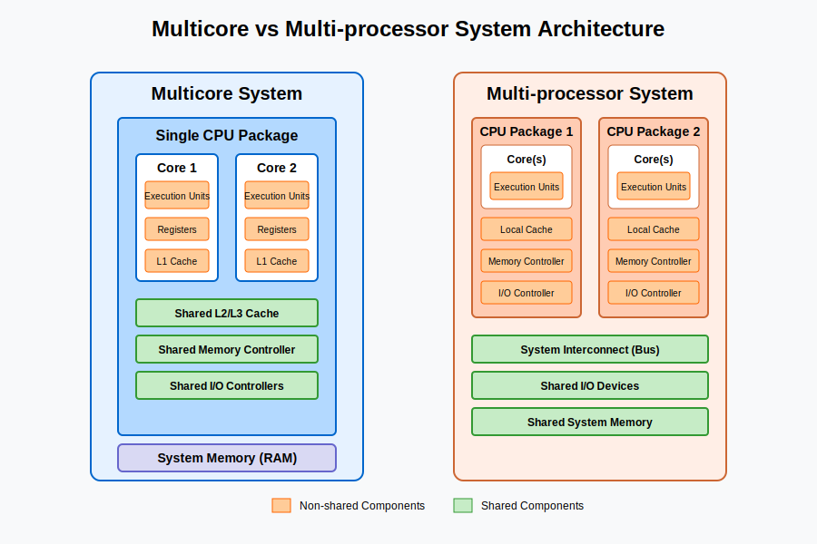

# Key Notes

## Python Resource Monitoring

* [psutil](https://pypi.org/project/psutil/)
  * Typical usages were performed in the M5 AST-1.
* 

# Multicore vs Multi-processor Systems Architecture

I'll explain the architectural differences between multicore and multi-processor systems, highlighting their shared and non-shared components.

## Multicore Systems

A multicore processor contains multiple processing units (cores) on a single physical chip. These cores share some resources while maintaining independent execution paths.

**Shared components:**
- Single physical chip/package
- Last-level cache (L3 cache in most modern systems)
- Memory controller
- I/O controllers
- System bus interface

**Non-shared components:**
- Each core has its own:
  - Execution units (ALU, FPU)
  - Registers
  - Private caches (L1, sometimes L2)
  - Instruction pipeline

## Multi-processor Systems

Multi-processor systems have multiple discrete physical processors, each potentially containing multiple cores, installed on the same motherboard.

**Shared components:**
- System memory (RAM)
- I/O devices
- Storage
- System bus/interconnect
- Operating system

**Non-shared components:**
- Each processor has its own:
  - Package/chip
  - Memory controller (in some architectures)
  - Last-level cache (L3)
  - Power delivery
  - All internal components (cores, registers, execution units)

Let me create a diagram to visualize these architectural differences:

## Key Differences

1. **Integration Level**
   - Multicore: Multiple cores integrated on a single die/chip
   - Multi-processor: Multiple separate physical processors on a motherboard

2. **Latency & Communication**
   - Multicore: Lower latency between cores due to shared last-level cache
   - Multi-processor: Higher latency between processors, communication through system interconnect

3. **Memory Access**
   - Multicore: Uniform Memory Access (UMA) - all cores have equal access to memory
   - Multi-processor: Often Non-Uniform Memory Access (NUMA) - processors have faster access to their local memory

4. **Scalability**
   - Multicore: Limited by die size and thermal constraints
   - Multi-processor: Higher scalability potential (servers can have dozens of physical processors)

5. **Cost & Complexity**
   - Multicore: Lower cost, simpler system design
   - Multi-processor: Higher cost, more complex system design and power requirements

## Common Use Cases

- **Multicore**: Consumer devices, workstations, entry-level servers
- **Multi-processor**: High-performance computing, enterprise servers, mission-critical systems

# What is the difference between spawning, forking and forkserver?

## Explanation:  
In Python's `multiprocessing` module, **spawning** is one of the three process creation methods (along with *forking* and *forkserver*).  

- **Spawning** means the parent process starts a **brand-new Python interpreter**, and only the necessary resources (like the target function and its arguments) are inherited by the child process.  
- This is the **default** method on **Windows** and **macOS (Python 3.8+)** due to safety and compatibility reasons.  
- It is **slower** than forking because it re-imports modules, but it avoids issues like inherited file descriptors or locks.  

### Why not the other options?  
- **B** describes **forking** (Unix default), where the child is an exact copy of the parent, inheriting all resources.  
- **C** describes the **forkserver** method, where a server process is pre-launched to handle new process requests.  

### Summary Table:  

| Method     | Behavior | OS Support | Speed | Safety |  
|------------|----------|------------|-------|--------|  
| **Spawn**  | Fresh interpreter, minimal inheritance | Windows, macOS (Py ≥3.8) | Slow | High |  
| **Fork**   | Child = parent clone (all resources)  | Unix (Linux, macOS Py <3.8) | Fast | Low (can inherit locks, handles) |  
| **Forkserver** | Pre-launched server forks new processes | Unix | Medium | Medium |  

